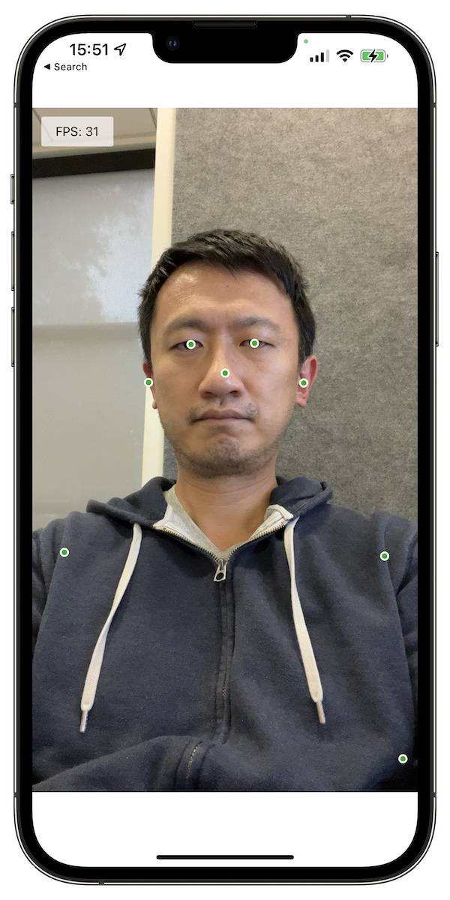
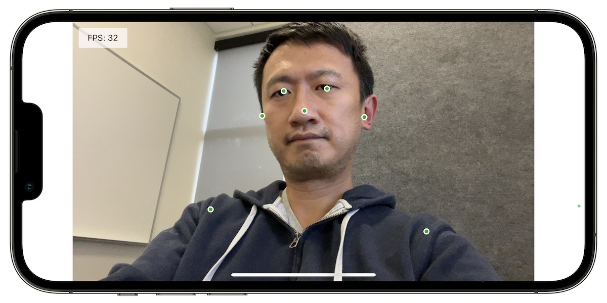

# Overview

A quick demo for running [TFJS Pose Detection][posedetection] model
([MoveNet.SinglePose.Ligntning][tfhub]) using
[TFJS React Native][tfjs-react-native] in an Expo project. It supports both
portrait and landscape mode with front and back camera. Only the keypoints are
rendered in the demo.

To run it locally:

```
$ yarn
$ yarn start
```

Then scan the QR code to open it in the `Expo Go` app.

If the app crashes on startup, see [here][readme] for more info.




[posedetection]: https://github.com/tensorflow/tfjs-models/tree/master/pose-detection
[tfhub]: https://tfhub.dev/google/tfjs-model/movenet/singlepose/lightning/4
[tfjs-react-native]: https://github.com/tensorflow/tfjs/tree/master/tfjs-react-native
[screenshots]: https://photos.app.goo.gl/U972ww4HpaKPK6jEA
[readme]: https://github.com/tensorflow/tfjs-examples/blob/master/react-native/README.md


## Development Goals:
- continuously runs to make a prediction on who is presented in the frame
  - an image is saved using the "StickerSmash" Save feature
  - The image is processed using step 10 from "github.com/efwoods/webcam-machine-learning/README.md"; if no one is detected, then the default is returned;
- Based on who is presented in frame, new social media information will be presented
- [ ] A button is to be added to train a new model
  - [ ] This button will follow steps 1 - 7 of "github.com/efwoods/webcam-machine-learning/README.md" to continuously collect images while the button is pressed. Once the button is released the model begins to train; 
  - [ ] steps 8 - 9 detail how the model will be trained in "github.com/efwoods/webcam-machine-learning/README.md". 
  - [ ] A modal will appear once the train-model button is released. This modal is similar to the modal from "github.com/efwoods/learn-expo/StickerSmash". 
    - [ ] The modal will include a list of fields to allow information to be included such as:
      - [ ] name, facebook, linkedin, other, etc.
      - [ ] The user will type this information into the field & click save to save the model on the user's device.
    - [ ] a save button must be created to complete the updating of the social media information. This button can be similar to the X in the modal from "github.com/efwoods/learn-expo/StickerSmash". 
- After the new identity is saved, the list of possible matches is updated & a new prediction is presented. When the predicted face is successfully presented, the prediction will detect the face & update the relevant information that is shown on the screen. 

### Currently in Development:
- [ ] A button is to be added to train a new model
  - [ ] This button will follow steps 1 - 7 of "github.com/efwoods/webcam-machine-learning/README.md" to continuously collect images while the button is pressed. Once the button is released the model begins to train; 
  - [ ] steps 8 - 9 detail how the model will be trained in "github.com/efwoods/webcam-machine-learning/README.md". 
  - [ ] A modal will appear once the train-model button is released. This modal is similar to the modal from "github.com/efwoods/learn-expo/StickerSmash". 
    - [ ] The modal will include a list of fields to allow information to be included such as:
      - [ ] name, facebook, linkedin, other, etc.
      - [ ] The user will type this information into the field & click save to save the model on the user's device.
    - [ ] a save button must be created to complete the updating of the social media information. This button can be similar to the X in the modal from "github.com/efwoods/learn-expo/StickerSmash". 
